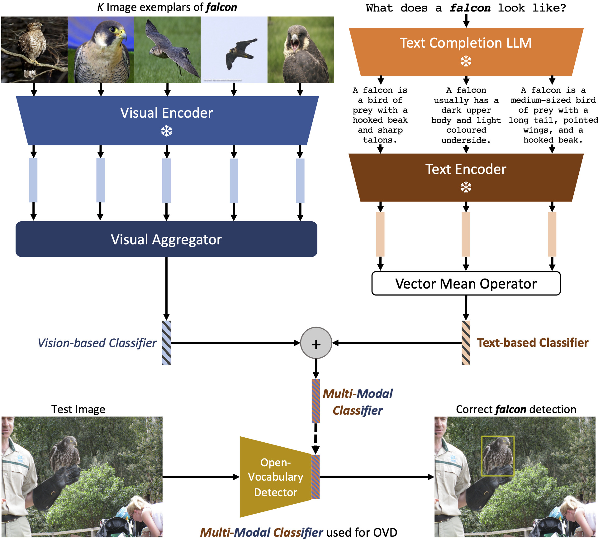

# Multi-Modal Classifiers for Open-Vocabulary Object Detection

  

> [**Multi-Modal Classifiers for Open Vocabulary Object Detection**](https://arxiv.org/abs/2306.05493),           
> Prannay Kaul, Weidi Xie, Andrew Zisserman                 
> *ICML 2023 ([arXiv 2201.02605](https://arxiv.org/abs/2306.05493))*         

## Updates

- **June 2023** Code and checkpoints for LVIS models in the main paper are released. Training code for visual aggregator to follow soon.

## Installation

See [installation instructions](docs/INSTALL.md).

## Benchmark evaluation and training

Please first [prepare datasets](datasets/README.md), then check our [MODEL ZOO](docs/MODEL_ZOO.md) to reproduce results in our paper.

## License

See [Detic](https://github.com/facebookresearch/Detic). Our code is based on this repository.

## Citation

If you find this project useful for your research, please use the following BibTeX entry.

    @inproceedings{Kaul2023,
      title={Multi-Modal Classifiers for Open-Vocabulary Object Detection},
      author={Kaul, Prannay and Xie, Weidi and Zisserman, Andrew},
      booktitle={ICML},
      year={2023}
    }
